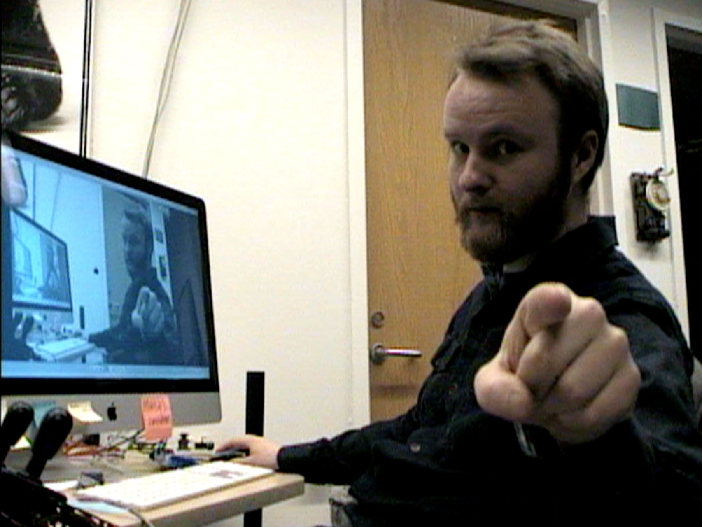

robocam_control
===============

This is a tiny little application that handles some of the pesky work of controlling A Canon VC-C4 surveillance/conferencing camera over RS232.

Starting out in Processing.org, eventually this will be an Arduino-based application to take over some aging, proprietary electronics that are used in an exhibition to control some webcams pointed at froggies.

Looking through the VC-C4 Programmer's Manual is a good start. I'm maintaining a copy of it in this repo, since it was next to impossible to find. Originally it was [here](http://csis.pace.edu/robotlab/papers/vcc4_pgmr_man.pdf).

