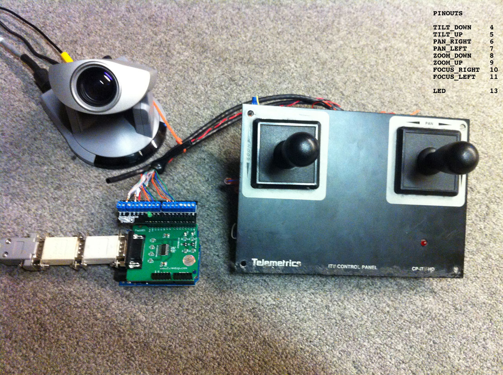

robocam_control
===============

Robocam Control is a PTZ Camera controller application for providing joystick control of a Canon VC-C4 camera over RS232.

#Arduino

This program features 
- A DAILY_RESET flag that can be modified if the cameras should be resetting their position on power up.
- A DEBUG_MODE flag that allows for easier human-readable messages to accompany the byte arrays.

##PINOUTS

- TILT_DOWN   D4
- TILT_UP 		D5
- PAN_RIGHT 	D6
- PAN_LEFT 		D7
- ZOOM_DOWN 	D8 
- ZOOM_UP 		D9
- FOCUS_RIGHT	D10
- FOCUS_LEFT	D11

- LED				D13

# Processing

Use the arrow keys to Pan and Tilt the camera. Use WASD to Zoom and Focus.

Looking through the VC-C4 Programmer's Manual is a good start. I'm maintaining a copy of it in this repo, since it was next to impossible to find. Originally it was [here](http://csis.pace.edu/robotlab/papers/vcc4_pgmr_man.pdf).

# Requirements

## Arduino
- RS232 Shield from cutedigi.com http://www.cutedigi.com/arduino-shields/rs232-shield-for-arduino.html
- *important!* Null Modem connection to the camera connector cable (this is done in the photo with one NULL MODEM beige Radio Shack part and one DB9 gender changer)
- Screw Shield http://wingshieldindustries.com/products/screwshield/ (optional)

## Processing
When using some USB-Serial adapters on Mac, you might need the Prolific USB - Serial Driver. We use this one:

- http://www.prolific.com.tw/US/ShowProduct.aspx?p_id=229&pcid=41
